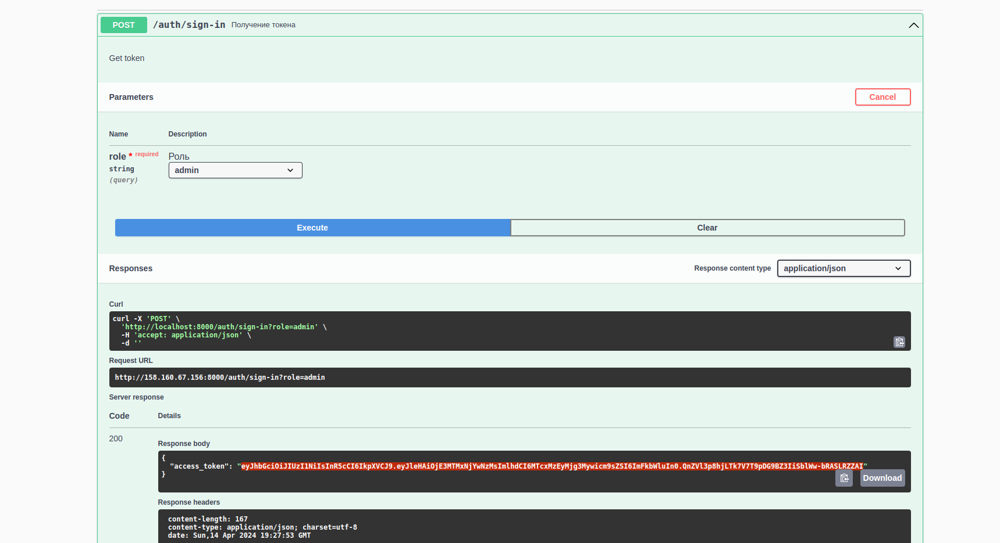
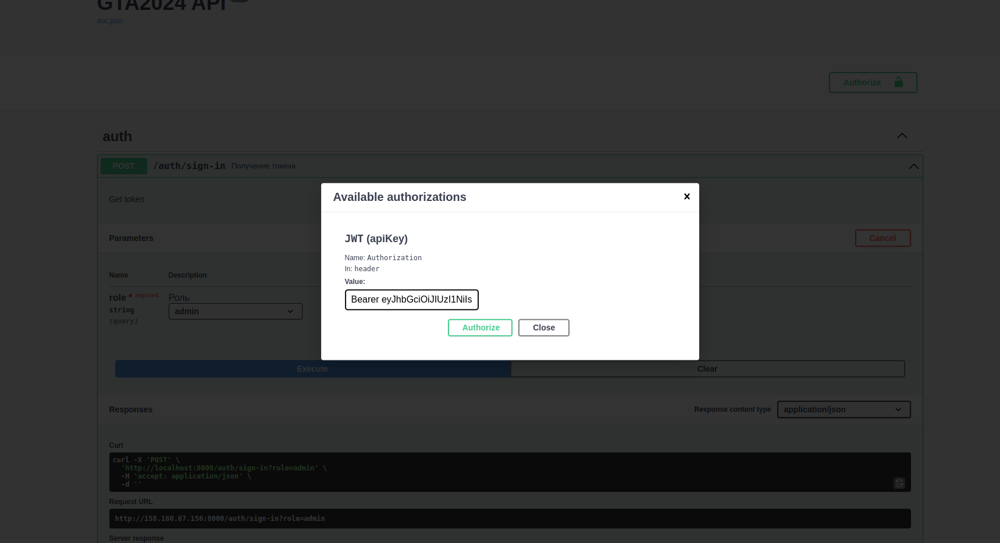

# Тестовое задание для стажёра Backend

Информация о выполненном задании в самом низу.

## Сервис баннеров
В Авито есть большое количество неоднородного контента, для которого необходимо иметь единую систему управления.  В частности, необходимо показывать разный контент пользователям в зависимости от их принадлежности к какой-либо группе. Данный контент мы будем предоставлять с помощью баннеров.
## Описание задачи
Необходимо реализовать сервис, который позволяет показывать пользователям баннеры, в зависимости от требуемой фичи и тега пользователя, а также управлять баннерами и связанными с ними тегами и фичами.
## Общие вводные
**Баннер** — это документ, описывающий какой-либо элемент пользовательского интерфейса. Технически баннер представляет собой  JSON-документ неопределенной структуры. 
**Тег** — это сущность для обозначения группы пользователей; представляет собой число (ID тега). 
**Фича** — это домен или функциональность; представляет собой число (ID фичи).  
1. Один баннер может быть связан только с одной фичей и несколькими тегами
2. При этом один тег, как и одна фича, могут принадлежать разным баннерам одновременно
3. Фича и тег однозначно определяют баннер

Так как баннеры являются для пользователя вспомогательным функционалом, допускается, если пользователь в течение короткого срока будет получать устаревшую информацию.  При этом существует часть пользователей (порядка 10%), которым обязательно получать самую актуальную информацию. Для таких пользователей нужно предусмотреть механизм получения информации напрямую из БД.
## Условия
1. Используйте этот [API](https://github.com/avito-tech/backend-trainee-assignment-2024/blob/main/api.yaml)
2. Тегов и фичей небольшое количество (до 1000), RPS — 1k, SLI времени ответа — 50 мс, SLI успешности ответа — 99.99%
3. Для авторизации доступов должны использоваться 2 вида токенов: пользовательский и админский.  Получение баннера может происходить с помощью пользовательского или админского токена, а все остальные действия могут выполняться только с помощью админского токена.  
4. Реализуйте интеграционный или E2E-тест на сценарий получения баннера.
5. Если при получении баннера передан флаг use_last_revision, необходимо отдавать самую актуальную информацию.  В ином случае допускается передача информации, которая была актуальна 5 минут назад.
6. Баннеры могут быть временно выключены. Если баннер выключен, то обычные пользователи не должны его получать, при этом админы должны иметь к нему доступ.

## Дополнительные задания:
Эти задания не являются обязательными, но выполнение всех или части из них даст вам преимущество перед другими кандидатами. 
1. Адаптировать систему для значительного увеличения количества тегов и фичей, при котором допускается увеличение времени исполнения по редко запрашиваемым тегам и фичам
2. Провести нагрузочное тестирование полученного решения и приложить результаты тестирования к решению
3. Иногда получается так, что необходимо вернуться к одной из трех предыдущих версий баннера в связи с найденной ошибкой в логике, тексте и т.д.  Измените API таким образом, чтобы можно было просмотреть существующие версии баннера и выбрать подходящую версию
4. Добавить метод удаления баннеров по фиче или тегу, время ответа которого не должно превышать 100 мс, независимо от количества баннеров.  В связи с небольшим временем ответа метода, рекомендуется ознакомиться с механизмом выполнения отложенных действий 
5. Реализовать интеграционное или E2E-тестирование для остальных сценариев
6. Описать конфигурацию линтера

## Требования по стеку
- **Язык сервиса:** предпочтительным будет Go, при этом вы можете выбрать любой, удобный вам. 
- **База данных:** предпочтительной будет PostgreSQL, при этом вы можете выбрать любую, удобную вам. 
- Для **деплоя зависимостей и самого сервиса** рекомендуется использовать Docker и Docker Compose.
## Ход решения
Если у вас возникнут вопросы по заданию, ответы на которые вы не найдете в описанных «Условиях», то вы вольны принимать решения самостоятельно.  
В таком случае приложите к проекту README-файл, в котором будет список вопросов и пояснения о том, как вы решили проблему и почему именно выбранным вами способом.
## Оформление решения
Необходимо предоставить публичный git-репозиторий на любом публичном хосте (GitHub / GitLab / etc), содержащий в master/main ветке: 
1. Код сервиса
2. Makefile c командами сборки проекта / Описанная в README.md инструкция по запуску
3. Описанные в README.md вопросы/проблемы, с которыми столкнулись,  и ваша логика их решений (если требуется)

## Get started

### Настроить окружение

```bash
make env
```

### Зпуск тестов

```bash
make test-with-docker-db
```

### Запуск приложения

1. Поднять БД и накатить миграции
```bash
make docker-db-init
```
2. Запуск приложения
```bash
make run
```

### Просто запустить тесты (с поднятой БД)
```bash
make test
```

### Накатить или откатить миграции
```bash
make migrate-up
make migrate-down
```

## Интерфейс-клиент (swagger)

После запуска приложения будет поднят swagger, который доступен по адресу `http://localhost:8000/swagger/index.html`.

Обработчики баннеров закрыты авторизацией JWT-токенами. Токены создаются сервером, подписываются секретным ключом и передаются клиенту, который в дальнейшем использует данный токен для подтверждения доступа к части функционала. Для админа это возможность получения списка баннеров, их содержимого, создание, обновление и удаление баннера, а для пользователя только получение содержимого активного баннер.

Чтобы можно было использовать обработчики, нужно:

1. Открыть обработчик `POST /auth/sign-in`


2. Выбрать роль, отправить запрос и получить `access_token`


3. Нажать на кнопку `Authorize` в правом верхнем углу и вставить `access_token` в поле в формате `Bearer <access_token>` и нажать на `Authorize`


4. Всё, отсальные http-обработчики доступны для запросов.

## Конфиги

Для конфигурации приложения используется файл `configs/config.yaml`.
Чувствительная информация находится в `.env` файле, который можно сгенерировать `make env` командой.

## Использование кеша

Для быстрой отдачи контента `/user_banner` был реализован кеш, который сохраняет в памяти сервиса контент банера на некоторое время (5 минут, но можно изменить в конфиге). Ускорение заключается в отсутсвии запросов к БД (не тратится время на IO и сеть).

## База данных

### Схема базы данных


### Миграции

Миграции находятся в папке `schema/`.

### Docker

БД поднимается с помощью докера, что позволяет легко и быстро поднять БД, сконфигурировать её и зафиксировать это в файле (docker-compose.yaml).

## Проблемы

* Были проблемы с понимаем структуры БД, но в конечном итоге пришла, к верному, что указала выше.
* Добавила 409 код ошибки, если связка `feature_id` и `tag_id` повторяется (по условию задачи не должен повторяться).
* Интеграционные тесты - было тяжело придумать, каким образом настраивать окружение для каждого теста, но после рисерча и долгих мучений получилось реализовать их.
